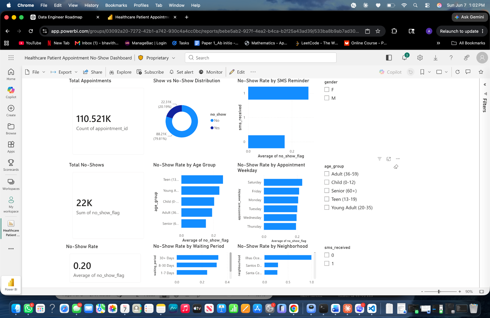

# Healthcare Patient Appointment No-Show Analysis

## Project Overview

This project analyzes healthcare appointment records to identify patterns linked with patient no-shows. The goal is to help healthcare administrators understand which patient groups and appointment factors are associated with missed appointments so they can improve scheduling, reminders, and follow-up planning.

The analysis was completed using Python for data cleaning, SQL for analysis logic, and Power BI for dashboard reporting.

## Business Problem

Healthcare clinics lose appointment capacity, staff time, and potential revenue when patients miss scheduled appointments. This project answers the question:

**Which patient and appointment factors are associated with higher no-show rates?**

The dashboard focuses on no-show trends by age group, waiting period, SMS reminder status, appointment weekday, and neighborhood.

## Dataset

The dataset contains medical appointment records with fields such as patient ID, appointment ID, gender, scheduled date, appointment date, age, neighborhood, SMS reminder status, medical conditions, and no-show status.

After cleaning, the analysis-ready dataset contains:

| Metric | Value |
|---|---:|
| Valid appointment records | 110,521 |
| Total no-shows | 22,319 |
| Overall no-show rate | 20.19% |
| Overall show-up rate | 79.81% |

## Tools Used

- Python
- pandas
- SQL
- Power BI
- Excel/CSV
- GitHub

## Data Cleaning Steps

The raw dataset was cleaned and prepared before dashboard development. Main cleaning steps included:

1. Standardized column names into readable snake_case format.
2. Converted scheduled and appointment date columns into date/time fields.
3. Removed invalid age records.
4. Removed records with negative waiting days.
5. Created `waiting_days` to measure the gap between scheduling date and appointment date.
6. Created `waiting_period` groups such as 1-7 days, 8-30 days, and 30+ days.
7. Created `age_group` categories such as Child, Teen, Young Adult, Adult, and Senior.
8. Converted no-show status into numeric flags for rate calculations.
9. Exported an analysis-ready CSV for Power BI reporting.

## Dashboard Overview

The Power BI dashboard includes:

- KPI card for total appointments
- KPI card for total no-shows
- KPI card for no-show rate
- Donut chart for show vs no-show distribution
- Bar chart for no-show rate by age group
- Bar chart for no-show rate by waiting period
- Bar chart for no-show rate by SMS reminder
- Bar chart for no-show rate by appointment weekday
- Bar chart for no-show rate by neighborhood
- Interactive slicers for gender, age group, and SMS received

## Dashboard Screenshot


## Key Insights

1. The cleaned dataset contains 110,521 valid appointment records.
2. Around 22,319 appointments were missed, resulting in an overall no-show rate of about 20.19%.
3. Teen and young adult patients show higher no-show rates compared with senior patients.
4. Longer waiting periods are associated with higher no-show rates.
5. Patients who received SMS reminders show a higher observed no-show rate. This should not be interpreted as SMS causing no-shows because reminders may have been sent more often to higher-risk patients.
6. Appointment weekday shows some variation, with Saturday appearing higher in the dashboard.
7. Neighborhood-level results should be interpreted carefully because smaller appointment counts can create unusually high percentages.

## Business Recommendations

1. Prioritize follow-up reminders for patients with long waiting periods.
2. Create targeted reminder strategies for teen and young adult patients.
3. Review SMS reminder strategy and compare no-show rates after controlling for waiting period and patient risk factors.
4. Monitor appointment scheduling patterns by weekday to improve clinic capacity planning.
5. Use neighborhood-level analysis only after checking appointment volume to avoid misleading conclusions from small sample sizes.

## Project Files

Suggested GitHub folder structure:

```text
healthcare-appointment-no-show-analysis/
│
├── data/
│   ├── raw/
│   └── cleaned/
│
├── notebooks/
│   └── data_cleaning_eda.ipynb
│
├── sql/
│   ├── create_tables.sql
│   └── data_analysis_queries.sql
│
├── dashboard/
│   └── healthcare_no_show_dashboard.pbix
│
├── images/
│   └── dashboard_screenshot.png
│
├── README.md
└── insights.md
```

## Resume Bullet

Analyzed 110K+ healthcare appointment records using Python, SQL, and Power BI to identify no-show trends by age group, waiting period, SMS reminders, appointment weekday, and neighborhood. Built an interactive dashboard with KPI cards, slicers, and visual insights to support appointment attendance improvement recommendations.
